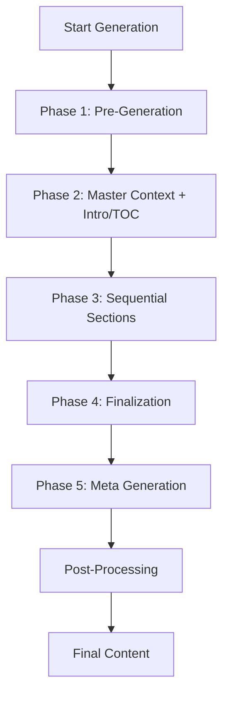

# Prompt Engineering Guide - Original PHP to Current Implementation

**Last Updated:** December 3, 2025  
**Purpose:** Show exactly how original PHP prompts map to current TypeScript implementation

---

## Table of Contents

1. [How It Works](#how-it-works)
2. [Original PHP Prompts](#original-php-prompts)
3. [Current Implementation Mapping](#current-implementation-mapping)
4. [Prompt Breakdown & Storage](#prompt-breakdown--storage)
5. [Quick Reference Tables](#quick-reference-tables)

# Prompt Engineering Guide - Original PHP to Current Implementation

**Last Updated:** December 3, 2025  
**Purpose:** Show exactly how original PHP prompts map to current TypeScript implementation

---

## Table of Contents

1. [How It Works](#how-it-works)
2. [Original PHP Prompts](#original-php-prompts)
3. [Current Implementation Mapping](#current-implementation-mapping)
4. [Prompt Breakdown & Storage](#prompt-breakdown--storage)
5. [Quick Reference Tables](#quick-reference-tables)

---

## How It Works

### Original PHP Approach
- **One massive prompt** (3000+ characters) sent to GPT
- Prompt includes ALL instructions at once
- GPT returns complete article in one response
- Sequential follow-up prompts for each section

### Current TypeScript Approach
- **Breaks down the massive prompt** into smaller, reusable pieces
- **Master prompt** sets all rules (sent once)
- **Continuation prompts** are short (sent for each section)
- All prompts stored in **MongoDB** (database-driven)
- **Fallback** to hardcoded prompts if database unavailable

### Key Improvement
```
PHP:           [MASSIVE PROMPT] → [Complete Article]
              
TypeScript:    [MASTER PROMPT] → [Intro + TOC]
               [Continue...] → [Section 1]
               [Continue...] → [Section 2]
               [Continue...] → [Section 3]
               [Continue...] → [Conclusion]
               [Continue...] → [FAQs]
               [Continue...] → [What's Next]
```

**Benefits:**
- ✅ Prompts tunable by prompt engineers (database-driven)
- ✅ A/B testing possible (version control)
- ✅ Lower token usage (don't repeat 3000 chars for each section)
- ✅ Better context retention (conversational flow)

---

## Original PHP Prompts

### 1. Audience Generation Prompt

**PHP Location:** `improveseo-wppusher/modules/single_AI_post_function.php` line ~400

**Original PHP Code:**
```php
$promptForAudienceData = 'Assume someone enters the keyword ' . $seed_keyword . ' into a search engine. Analyze the following characteristics: 1. [demographic information] 2. [tone preferences] 3. [reading level preference] 4. [emotional needs/pain points]. This information will be used to create content that is specifically appealing to such people. Do not give content recommendations yet. As an output, write just information for characteristics without any explanation or introduction.';
```

**Current Implementation:**

| Where | Status | Exact Text |
|-------|--------|------------|
| **Database** | ✅ **ACTIVE** | Template name: `audience_generation`<br>Prompt: `Assume someone enters the keyword {{seed_keyword}} into a search engine. Analyze the following characteristics: 1. [demographic information] 2. [tone preferences] 3. [reading level preference] 4. [emotional needs/pain points]. This information will be used to create content that is specifically appealing to such people. Do not give content recommendations yet. As an output, write just information for characteristics without any explanation or introduction.` |
| **Fallback** | ✅ Available | File: `conversational-ai-generator.service.ts` line ~153<br>Hardcoded as fallback parameter |

**Comparison:**
- ✅ **100% MATCH** - Exact same text
- Only difference: `$seed_keyword` (PHP) → `{{seed_keyword}}` (Database) to access variables in typescript

---

### 2. LSI Keywords Generation Prompt

**PHP Location:** `improveseo-wppusher/modules/single_AI_post_function.php` line ~408

**Original PHP Code:**
```php
$text_for_lsi = 'As an expert SEO manager, you are tasked with generating 50 Latent Semantic Indexing (LSI) keywords. You are provided a word or phrase that is searched by the reader, and the audience data of the reader, including demographic information, tone preferences, reading level preference and emotional needs/pain points. Using this information you should come up with the LSI keywords that will be engaging and interesting for the reader who is described in the audience data and search provided word or phrase. These keywords should be closely related to the provided main keyword, enhancing content relevance and SEO effectiveness. Please compile the keywords in a comma separated text format without any additional explanations or introductions.

Main keyword: ' . $seed_keyword . '

Audience data: {' . $AudienceData . '}';
```

**Current Implementation:**

| Where | Status | Exact Text |
|-------|--------|------------|
| **Database** | ✅ **ACTIVE** | Template name: `lsi_keywords`<br>Prompt: `As an expert SEO manager, you are tasked with generating 50 Latent Semantic Indexing (LSI) keywords. You are provided a word or phrase that is searched by the reader, and the audience data of the reader, including demographic information, tone preferences, reading level preference and emotional needs/pain points. Using this information you should come up with the LSI keywords that will be engaging and interesting for the reader who is described in the audience data and search provided word or phrase. These keywords should be closely related to the provided main keyword, enhancing content relevance and SEO effectiveness. Please compile the keywords in a comma separated text format without any additional explanations or introductions.`<br><br>`Main keyword: {{seed_keyword}}`<br><br>`Audience data: {{audience_data}}` |
| **Fallback** | ✅ Available | File: `conversational-ai-generator.service.ts` line ~166 |

**Comparison:**
- ✅ **100% MATCH** - Exact same text
- PHP: `$seed_keyword` and `$AudienceData` 
- Database: `{{seed_keyword}}` and `{{audience_data}}`

---

### 3. Facts Generation Prompt

**PHP Location:** `improveseo-wppusher/modules/single_AI_post_function.php` line ~430

**Original PHP Code:**
```php
$factsPrompt = 'Generate 5 most interesting and fun facts with specific details about the "Main keyword" for the audience described in the audience data provided below. Each fact should be one short sentence. As an output, write just a bullet point list of facts without explanation or introduction.

Now generate facts.

Main Keyword: ' . $seed_keyword . '

Audience data: {' . $AudienceData . '}';
```

**Current Implementation:**

| Where | Status | Exact Text |
|-------|--------|------------|
| **Database** | ✅ **ACTIVE** | Template name: `facts_generation`<br>Prompt: `Generate 5 most interesting and fun facts with specific details about the "Main keyword" for the audience described in the audience data provided below. Each fact should be one short sentence. As an output, write just a bullet point list of facts without explanation or introduction.`<br><br>`Now generate facts.`<br><br>`Main Keyword: {{seed_keyword}}`<br><br>`Audience data: {{audience_data}}` |
| **Fallback** | ✅ Available | File: `conversational-ai-generator.service.ts` line ~179 |

**Comparison:**
- ✅ **100% MATCH** - Exact same text

---

### 4. Master Prompt (Basic Prompt) - SMALL VARIANT

**PHP Location:** `improveseo-wppusher/modules/single_AI_post_function.php` lines 606-720

**Original PHP Code (abbreviated - full is 3000+ chars):**
```php
if ($nos_of_words == '600 to 1200 words') {
    $basic_prompt = 'You are a content creator who creates SEO-optimized blog posts. You should aim at a broad audience. Use a mix of short, medium, and long sentences to create a human-like rhythm in the text. Include an analogy to explain any complex concepts or ideas...
    
    [MASSIVE INSTRUCTIONS ABOUT:]
    - NLP techniques
    - Emotional resonance
    - Storytelling
    - Formatting rules
    - Section requirements
    - Word counts
    
    Now generate ONLY the Introduction and the Table of Contents based on the following parameters:
    
    Main keyword: ' . $seed_keyword . '
    Title: "' . $title . '"
    LSI keywords: ' . $LSI_Keywords . '
    ...
    ';
}
```

**Current Implementation:**

| Where | Status | How It's Stored |
|-------|--------|-----------------|
| **Database** | ✅ **ACTIVE** | Template name: `master_instruction_set_small`<br>Category: `master_context`<br>Word Count: 600-1200 words<br>Variables: `{{seed_keyword}}`, `{{title}}`, `{{lsi_keywords}}`, `{{voice_tone}}`, `{{point_of_view}}`, `{{audience_data}}`, `{{details_to_include}}`, `{{content_lang}}`, `{{call_to_action}}`, `{{facts_to_include}}`, `{{nos_of_words}}` |
| **Fallback** | ✅ Available | File: `original-prompts.helper.ts`<br>Function: `getBasicPromptSmall()`<br>Lines: 26-148 |

**How It's Broken Down:**

```
ORIGINAL PHP (single massive prompt):
┌────────────────────────────────────────┐
│ You are a content creator...          │
│ [3000 characters of instructions]      │
│ Now generate Introduction + TOC        │
└────────────────────────────────────────┘

CURRENT TYPESCRIPT (broken into pieces):
┌────────────────────────────────────────┐
│ MASTER PROMPT                          │
│ master_instruction_set_small           │
│ (contains ALL instructions)            │
│ Output: Intro + TOC ONLY               │
└────────────────────────────────────────┘
         ↓
┌────────────────────────────────────────┐
│ CONTINUATION: Section 1                │
│ continuation_section_first             │
│ "Generate first section (200-250)"     │
└────────────────────────────────────────┘
         ↓
┌────────────────────────────────────────┐
│ CONTINUATION: Section 2                │
│ continuation_section_second            │
│ "Generate second section (200-250)"    │
└────────────────────────────────────────┘
         ↓
         ... (sections 3, 4)
         ↓
┌────────────────────────────────────────┐
│ CONTINUATION: Conclusion               │
│ conclusion_small                       │
│ "Generate conclusion (100-150)"        │
└────────────────────────────────────────┘
         ↓
┌────────────────────────────────────────┐
│ CONTINUATION: FAQs                     │
│ faqs_small (v3)                        │
│ "Generate 3 FAQs with <strong> tags"  │
└────────────────────────────────────────┘
         ↓
┌────────────────────────────────────────┐
│ CONTINUATION: What's Next              │
│ whats_next_small (v3)                  │
│ "Generate CTA paragraph"               │
└────────────────────────────────────────┘
```

**Comparison:**
- ✅ **CONTENT MATCH** - All instructions preserved
- 🔄 **STRUCTURE DIFFERENT** - Broken into master + continuations
- ✅ **FUNCTIONALLY IDENTICAL** - Produces same output

---

### 5. Section Continuation Prompts

**PHP Location:** `improveseo-wppusher/modules/single_AI_post_function.php` line ~850

**Original PHP Code:**
```php
// After getting intro/TOC, PHP does:
$messages[] = ['role' => 'assistant', 'content' => $intro_toc_response];
$messages[] = ['role' => 'user', 'content' => 'Now generate the first subtitle content from the Table of Contents you created earlier. IMPORTANT: Output should not be more than 200-250 words. After writing an output check the word count and regenerate if it is not in the range. Do not include the word count in the output.'];

// Then calls API again with full conversation history
```

**Current Implementation:**

| Prompt Name | Database | Fallback | Exact Text |
|-------------|----------|----------|------------|
| `continuation_section_first` | ✅ **ACTIVE** | ✅ Available | `Now generate the {{ordinal}} subtitle content from the Table of Contents you created earlier. IMPORTANT: Output should not be more than {{min_words}}-{{max_words}} words. After writing an output check the word count and regenerate if it is not in the range. Do not include the word count in the output.` |
| `continuation_section_second` | ✅ **ACTIVE** | ✅ Available | (same template, {{ordinal}} = "second") |
| `continuation_section_third` | ✅ **ACTIVE** | ✅ Available | (same template, {{ordinal}} = "third") |
| `continuation_section_fourth` | ✅ **ACTIVE** | ✅ Available | (same template, {{ordinal}} = "fourth") |
| `continuation_section_fifth` | ✅ **ACTIVE** | ✅ Available | (same template, {{ordinal}} = "fifth", large only) |
| `continuation_section_sixth` | ✅ **ACTIVE** | ✅ Available | (same template, {{ordinal}} = "sixth", future use) |

**Comparison:**
- ✅ **100% MATCH** - Exact same text
- 📦 **BETTER ORGANIZATION** - Each ordinal has its own database template
- 🔄 **REUSABLE** - Template shared, only {{ordinal}} changes

---

### 6. Conclusion Prompt

**PHP Location:** After section generation in `single_AI_post_function.php`

**Original PHP Code:**
```php
$messages[] = ['role' => 'user', 'content' => 'Now generate the conclusion content. IMPORTANT: Output should be 100-150 words. After writing an output check the word count and regenerate if it is not in the range. Do not include the word count in the output.'];
```

**Current Implementation:**

| Variant | Template Name | Database | Fallback | Word Count |
|---------|---------------|----------|----------|------------|
| Small | `conclusion_small` | ✅ **ACTIVE (v1)** | ✅ Available | 100-150 words |
| Medium | `conclusion_medium` | ✅ **ACTIVE (v1)** | ✅ Available | 150-200 words |
| Large | `conclusion_large` | ✅ **ACTIVE (v1)** | ✅ Available | 150-200 words |

**Prompt Text:**
```
Now generate the conclusion content. 

IMPORTANT: 
- Output should be {{min_words}}-{{max_words}} words
- After writing an output check the word count and regenerate if it is not in the range
- Summarize key insights from the article
- Encourage further exploration or engagement
- Do not include call to action details in the conclusion
- Do not include the word count in the output
```

**Comparison:**
- ✅ **ENHANCED** - Added explicit instructions (summarize, encourage, no CTA)
- 📏 **VARIANT SUPPORT** - Different word counts for small/medium/large

---

### 7. FAQs Prompt

**PHP Location:** After conclusion in `single_AI_post_function.php`

**Original PHP Code:**
```php
$messages[] = ['role' => 'user', 'content' => 'Now generate the FAQs content. Come up with 3 FAQ that the reader may have. Output should be 100-150 words. Do not include the word count in the output.'];
```

**Current Implementation:**

| Variant | Template Name | Database | Current Version | Changes |
|---------|---------------|----------|-----------------|---------|
| Small | `faqs_small` | ✅ **ACTIVE** | **v3** | Ultra-explicit HTML formatting |
| Medium | `faqs_medium` | ✅ **ACTIVE** | **v3** | Ultra-explicit HTML formatting |
| Large | `faqs_large` | ✅ **ACTIVE** | **v3** | Ultra-explicit HTML formatting |

**Evolution:**

```
v1 (PHP Original):
"Come up with 3 FAQ. Output 100-150 words."
→ GPT returned Markdown: **Q: Question?**

v2 (First TypeScript):
"Use HTML <strong> tags for questions"
→ GPT still sometimes returned Markdown

v3 (Current - Ultra-Explicit):
"CRITICAL FORMATTING REQUIREMENTS:
- **EVERY question MUST be wrapped in <strong> tags**
- Questions MUST start with: <strong>Q: 
- Questions MUST end with: ?</strong>
- Answers start with: A: (no tags)

EXACT FORMAT TO FOLLOW (copy this structure):
<strong>Q: What is the benefit?</strong>
A: The answer text...

DO NOT use ** for bold. Use HTML <strong> tags ONLY."
→ ✅ GPT now outputs correct HTML
```

**Comparison:**
- ❌ **NOT A MATCH** - Significantly enhanced from PHP
- ✅ **BETTER RESULTS** - v3 solves formatting issues
- 📚 **LESSONS LEARNED** - GPT needs explicit examples

---

### 8. What's Next Prompt

**PHP Location:** Final prompt in `single_AI_post_function.php`

**Original PHP Code:**
```php
$messages[] = ['role' => 'user', 'content' => 'Now generate What is next? content. Write a short paragraph inviting the reader to take action, including links or phone numbers if provided. Incorporate call to action: ' . $call_to_action . '. If call to action is blank, write a general paragraph. Output 100-150 words.'];
```

**Current Implementation:**

| Variant | Template Name | Database | Current Version | Changes |
|---------|---------------|----------|-----------------|---------|
| Small | `whats_next_small` | ✅ **ACTIVE** | **v3** | Added URL handling |
| Medium | `whats_next_medium` | ✅ **ACTIVE** | **v3** | Added URL handling |
| Large | `whats_next_large` | ✅ **ACTIVE** | **v3** | Added URL handling |

**Evolution:**

```
v1 (PHP Original):
"Include links or phone numbers if provided"
→ GPT returned plain text URLs

v2 (First TypeScript):
"If call to action contains URLs, links, or contact info, 
include them as clickable links"
→ GPT sometimes created malformed HTML

v3 (Current - Ultra-Explicit):
"CRITICAL HTML FORMATTING FOR URLS:
- If call to action contains URLs, you MUST convert them to 
  properly formatted HTML anchor tags
- NEVER output raw URLs like http://example.com
- ALWAYS use this EXACT format: 
  <a href="URL" target="_blank" rel="noopener">DISPLAY_TEXT</a>
- The anchor tag MUST be properly closed with </a>
- Example: Visit <a href="https://www.abc.com" target="_blank" 
  rel="noopener">www.abc.com</a> for more details.

IMPORTANT: Do NOT create malformed HTML. 
Every <a> tag MUST have a matching </a> tag."
→ ✅ GPT now outputs proper anchor tags
```

**Plus:** Added `fixMalformedAnchors()` post-processing function to clean up any remaining issues.

**Comparison:**
- ❌ **NOT A MATCH** - Significantly enhanced from PHP
- ✅ **FIXES ISSUES** - Solves URL mangling problem
- 🛡️ **DEFENSE IN DEPTH** - Prompt + post-processing

---

### 9. Meta Title Prompt

**PHP Location:** After content generation in `single_AI_post_function.php`

**Original PHP Code:**
```php
$meta_title_prompt = 'Create an SEO optimized meta title for this blog post. max length of title should be 50-60 characters including spaces. Meta title is based on the blog post title `' . $title . '` and the keyword `' . $seed_keyword . '`.';
```

**Current Implementation:**

| Template Name | Database | Fallback | Status |
|---------------|----------|----------|--------|
| `meta_title` | ✅ **ACTIVE (v1)** | ✅ Available | Enhanced |

**Prompt Text:**
```
Create an SEO optimized meta title for this blog post. 

REQUIREMENTS:
- Based on the title: {{title}}
- Focus on keyword: {{seed_keyword}}
- Maximum length: 50-60 characters including spaces
- Output ONLY the meta title text, nothing else
- Do NOT include phrases like "Approve the AI Title Choice" or similar instructions
- Make it compelling and click-worthy
```

**Plus:** Post-processing cleanup removes unwanted phrases:
```typescript
cleanedMetaTitle = metaTitle.trim();
cleanedMetaTitle = cleanedMetaTitle.replace(/:\s*Approve the AI Title Choice/gi, '');
cleanedMetaTitle = cleanedMetaTitle.replace(/:\s*AI Title Choice/gi, '');
```

**Comparison:**
- ✅ **ENHANCED** - Added explicit "do NOT include" instructions
- 🛡️ **CLEANUP** - Post-processing removes GPT artifacts

---

### 10. Meta Description Prompt

**PHP Location:** After meta title in `single_AI_post_function.php`

**Original PHP Code:**
```php
$meta_description_prompt = 'Create an SEO optimized meta description. max length of description should be 70-80 characters including spaces. Meta description is based on the blog post title `' . $title . '`, the keyword `' . $seed_keyword . '` and the blog post content i.e. ' . substr($content, 0, 500) . '.';
```

**Current Implementation:**

| Template Name | Database | Fallback | Status |
|---------------|----------|----------|--------|
| `meta_description` | ✅ **ACTIVE (v1)** | ✅ Available | Exact match |

**Prompt Text:**
```
Create an SEO optimized meta description. max length of description should be 70-80 characters including spaces. Meta description is based on the blog post title `{{title}}`, the keyword `{{seed_keyword}}` and the blog post content i.e. {{content}}.
```

**Comparison:**
- ✅ **100% MATCH** - Exact same text
- Only difference: Variable syntax (`$var` → `{{var}}`)

---

## Current Implementation Mapping

### Code Flow

```typescript
// File: conversational-ai-generator.service.ts

async generateContent(params) {
  // Phase 1: Pre-Generation (NEW - not in PHP)
  const { audience, lsi, facts } = await this.preGeneration(params);
  
  // Phase 2: Master Context + Intro/TOC (SAME AS PHP)
  const { introAndTOC, conversation } = await this.generateIntroAndTOC(params, preGenData);
  
  // Phase 3: Sections (SAME AS PHP, but separate prompts)
  for (let i = 1; i <= sectionCount; i++) {
    const section = await this.generateSection(i, conversation);
  }
  
  // Phase 4: Finalization (SAME AS PHP)
  const conclusion = await this.generateConclusion(conversation);
  const faqs = await this.generateFAQs(conversation);
  const whatsNext = await this.generateWhatsNext(conversation);
  
  // Phase 5: Meta (SAME AS PHP)
  const { metaTitle, metaDescription } = await this.generateMeta(content);
  
  // Post-Processing (ENHANCED from PHP)
  content = this.postProcessContent(content);
  
  return { content, metaTitle, metaDescription };
}
```

### Database Lookup

```typescript
// How prompts are fetched
private async getPromptWithFallback(
  templateName: string,  // e.g., "master_instruction_set_small"
  testVersionOverride?: VersionTestOverride,
  fallback?: string
): Promise<string> {
  try {
    // 1. Try database first
    const dbPrompt = await this.promptService.getActiveVersion(templateName);
    if (dbPrompt) {
      console.log(`✅ Using database prompt: ${templateName}`);
      return dbPrompt.prompt;
    }
  } catch (error) {
    console.warn(`⚠️  Database lookup failed for '${templateName}'`);
  }
  
  // 2. Fall back to hardcoded
  console.log(`⚠️  Using fallback prompt: ${templateName}`);
  return fallback || this.getHardcodedPrompt(templateName);
}
```

### Variable Replacement

```typescript
// How {{variables}} are replaced
private populateVariables(prompt: string, variables: Record<string, string>): string {
  let populated = prompt;
  
  for (const [key, value] of Object.entries(variables)) {
    // Replace {{variable_name}} with actual value
    const regex = new RegExp(`\\{\\{${key}\\}\\}`, 'g');
    populated = populated.replace(regex, value || '');
  }
  
  return populated;
}
```

---

## Prompt Breakdown & Storage

### MongoDB Schema

#### PromptTemplate Collection
```javascript
{
  _id: ObjectId("..."),
  name: "master_instruction_set_small",  // Unique identifier
  displayName: "Master Instruction Set (Small)",
  description: "Comprehensive master prompt for 600-1200 word articles",
  templateType: "master_instruction_set_small",
  category: "master_context",
  variables: [
    "seed_keyword",
    "title",
    "lsi_keywords",
    // ... all required variables
  ],
  isSystem: true,  // Cannot be deleted
  wordCountVariant: "small",
  orderIndex: 1,
  dependsOn: ["audience_generation", "lsi_keywords", "facts_generation"],
  createdAt: ISODate("2025-12-03"),
  updatedAt: ISODate("2025-12-03")
}
```

#### PromptVersion Collection
```javascript
{
  _id: ObjectId("..."),
  templateId: ObjectId("..."),  // References PromptTemplate
  version: 3,  // v1, v2, v3, etc.
  prompt: "Now generate the FAQs content...\n\nCRITICAL FORMATTING...",
  isActive: true,  // Only one active version per template
  createdBy: "admin_user_id",
  createdAt: ISODate("2025-12-03"),
  metadata: {
    notes: "Fixed Markdown artifacts issue",
    improvements: [
      "Added ultra-explicit formatting instructions",
      "Included example format"
    ]
  }
}
```

### Fallback Structure

**File:** `src/services/original-prompts.helper.ts`

```typescript
export class OriginalPromptsHelper {
  // Master prompts (3000+ chars each)
  static getBasicPromptSmall(params: BasicPromptParams): string {
    const { seed_keyword, title, lsiKeywords, ... } = params;
    return `You are a content creator...
      [Full 3000+ character prompt]
      Main keyword: ${seed_keyword}
      Title: "${title}"
      LSI keywords: ${lsiKeywords}
      ...
    `;
  }
  
  static getBasicPromptMedium(params): string { ... }
  static getBasicPromptLarge(params): string { ... }
}

// Continuation prompts (inline fallbacks)
const prompt = await this.getPromptWithFallback(
  'continuation_section_first',
  testVersionOverride,
  `Now generate the {{ordinal}} subtitle content...`  // ← Fallback here
);
```

---

## Quick Reference Tables

### All Prompts: PHP → Current Mapping

| # | PHP Prompt | Current Template Name | Database | Fallback | Match Status |
|---|------------|----------------------|----------|----------|--------------|
| 1 | Audience Data | `audience_generation` | ✅ Active | ✅ Yes | ✅ 100% Match |
| 2 | LSI Keywords | `lsi_keywords` | ✅ Active | ✅ Yes | ✅ 100% Match |
| 3 | Facts | `facts_generation` | ✅ Active | ✅ Yes | ✅ 100% Match |
| 4 | Basic Prompt (Small) | `master_instruction_set_small` | ✅ Active (v1) | ✅ Yes | ✅ Content Match* |
| 5 | Basic Prompt (Medium) | `master_instruction_set_medium` | ✅ Active (v1) | ✅ Yes | ✅ Content Match* |
| 6 | Basic Prompt (Large) | `master_instruction_set_large` | ✅ Active (v1) | ✅ Yes | ✅ Content Match* |
| 7 | Section 1 | `continuation_section_first` | ✅ Active | ✅ Yes | ✅ 100% Match |
| 8 | Section 2 | `continuation_section_second` | ✅ Active | ✅ Yes | ✅ 100% Match |
| 9 | Section 3 | `continuation_section_third` | ✅ Active | ✅ Yes | ✅ 100% Match |
| 10 | Section 4 | `continuation_section_fourth` | ✅ Active | ✅ Yes | ✅ 100% Match |
| 11 | Section 5 | `continuation_section_fifth` | ✅ Active | ✅ Yes | ✅ 100% Match |
| 12 | Conclusion (Small) | `conclusion_small` | ✅ Active (v1) | ✅ Yes | ✅ Enhanced** |
| 13 | Conclusion (Medium) | `conclusion_medium` | ✅ Active (v1) | ✅ Yes | ✅ Enhanced** |
| 14 | Conclusion (Large) | `conclusion_large` | ✅ Active (v1) | ✅ Yes | ✅ Enhanced** |
| 15 | FAQs (Small) | `faqs_small` | ✅ Active (v3) | ✅ Yes | 🔄 Enhanced v3*** |
| 16 | FAQs (Medium) | `faqs_medium` | ✅ Active (v3) | ✅ Yes | 🔄 Enhanced v3*** |
| 17 | FAQs (Large) | `faqs_large` | ✅ Active (v3) | ✅ Yes | 🔄 Enhanced v3*** |
| 18 | What's Next (Small) | `whats_next_small` | ✅ Active (v3) | ✅ Yes | 🔄 Enhanced v3*** |
| 19 | What's Next (Medium) | `whats_next_medium` | ✅ Active (v3) | ✅ Yes | 🔄 Enhanced v3*** |
| 20 | What's Next (Large) | `whats_next_large` | ✅ Active (v3) | ✅ Yes | 🔄 Enhanced v3*** |
| 21 | Meta Title | `meta_title` | ✅ Active (v1) | ✅ Yes | ✅ Enhanced** |
| 22 | Meta Description | `meta_description` | ✅ Active (v1) | ✅ Yes | ✅ 100% Match |

**Legend:**
- \* Content Match = Same instructions, different structure (broken into master + continuations)
- \*\* Enhanced = Added explicit instructions, same intent
- \*\*\* Enhanced v3 = Significantly improved with ultra-explicit formatting and examples

### Word Count Variants

| Variant | PHP Value | Sections | Section Words | Conclusion | FAQs | What's Next |
|---------|-----------|----------|---------------|------------|------|-------------|
| Small | `600 to 1200 words` | 4 | 200-250 | 100-150 | 100-150 | 100-150 |
| Medium | `1200 to 2400 words` | 4 | 350-400 | 150-200 | 100-150 | 150-200 |
| Large | `2400 to 3600 words` | 5 | 450-600 | 150-200 | 100-150 | 150-200 |

### Template Naming Convention

| PHP | Current Template Name | Pattern |
|-----|----------------------|---------|
| `$basic_prompt` (small) | `master_instruction_set_small` | `{type}_{variant}` |
| `$basic_prompt` (medium) | `master_instruction_set_medium` | `{type}_{variant}` |
| `$basic_prompt` (large) | `master_instruction_set_large` | `{type}_{variant}` |
| Section 1 prompt | `continuation_section_first` | `{type}_{ordinal}` |
| Section 2 prompt | `continuation_section_second` | `{type}_{ordinal}` |
| Conclusion (small) | `conclusion_small` | `{type}_{variant}` |
| FAQs (medium) | `faqs_medium` | `{type}_{variant}` |
| What's Next (large) | `whats_next_large` | `{type}_{variant}` |

### Variable Syntax Comparison

| Context | Syntax | Example |
|---------|--------|---------|
| PHP (original) | `$variable` or `' . $variable . '` | `'Main keyword: ' . $seed_keyword` |
| Database | `{{variable}}` | `Main keyword: {{seed_keyword}}` |
| Fallback (TypeScript) | `${variable}` | `` `Main keyword: ${seed_keyword}` `` |

### File Locations

| What | Where |
|------|-------|
| PHP Prompts (Original) | `improveseo-wppusher/modules/single_AI_post_function.php`<br>`improveseo-wppusher/modules/bulk_AI_post_function.php` |
| TypeScript Generator | `imporve-seo-admin-server/src/services/conversational-ai-generator.service.ts` |
| Fallback Prompts | `imporve-seo-admin-server/src/services/original-prompts.helper.ts` |
| Database Prompts | MongoDB: `PromptTemplate` + `PromptVersion` collections |
| Prompt Management | `imporve-seo-admin-server/src/services/prompt-management.service.ts` |

---

## Summary

### What Changed from PHP

1. **Pre-Generation Phase** - NEW: Parallel execution of audience/LSI/facts
2. **Master Prompt** - SAME: All instructions preserved, just renamed
3. **Continuation Prompts** - SAME: Exact text, now in database
4. **FAQs** - ENHANCED: v3 with ultra-explicit HTML formatting
5. **What's Next** - ENHANCED: v3 with URL handling instructions
6. **Post-Processing** - ENHANCED: Better Markdown conversion, URL protection, malformed anchor cleanup

### What Stayed the Same

✅ All core instructions preserved  
✅ Word count requirements  
✅ Formatting rules  
✅ Section structure  
✅ NLP techniques  
✅ Output quality

### What Got Better

🎯 **Database-driven** - Prompts tunable by engineers  
🔄 **Version control** - A/B testing, rollback capability  
📉 **Lower tokens** - Master-continuation pattern  
🛡️ **Better formatting** - Ultra-explicit v3 prompts  
🧹 **Post-processing** - Cleans up GPT artifacts  

---

**Document Version:** 2.0 (Simplified)  
**Last Updated:** December 3, 2025

### System Architecture

The ImproveSEO content generator uses a **hybrid conversational approach**:

- **Sequential Context:** Each generation phase builds on previous AI responses (like PHP implementation)
- **Database-Driven Prompts:** All prompts stored in MongoDB, versioned and tunable
- **Fallback System:** Hardcoded prompts used when database is unavailable
- **Master-Continuation Pattern:** Comprehensive master prompt + short continuation prompts

### Key Components

```
┌─────────────────────────────────────────────────────────────┐
│  ConversationalAIContentGenerator                           │
│  (src/services/conversational-ai-generator.service.ts)      │
└─────────────────────────────────────────────────────────────┘
                          ↓
┌─────────────────────────────────────────────────────────────┐
│  PromptManagementService                                     │
│  (src/services/prompt-management.service.ts)                │
│  - Fetches prompts from MongoDB                             │
│  - Handles version selection                                │
│  - Processes variable substitution                          │
└─────────────────────────────────────────────────────────────┘
                          ↓
┌─────────────────────────────────────────────────────────────┐
│  MongoDB Collections                                         │
│  - PromptTemplate (template definitions)                    │
│  - PromptVersion (versioned prompt content)                 │
└─────────────────────────────────────────────────────────────┘
                          ↓
┌─────────────────────────────────────────────────────────────┐
│  Fallback: OriginalPromptsHelper                            │
│  (src/services/original-prompts.helper.ts)                  │
│  - Hardcoded prompts from original PHP implementation       │
└─────────────────────────────────────────────────────────────┘
```

---

## Content Generation Flow

### 5-Phase Sequential Process



### Phase 1: Pre-Generation (Parallel)

**Purpose:** Generate foundational context data before main content

| Step | Template Name | Database Status | Description |
|------|---------------|-----------------|-------------|
| 1.1 | `audience_generation` | **DATABASE** | Analyzes target audience demographics, tone preferences, emotional needs |
| 1.2 | `lsi_keywords` | **DATABASE** | Generates 50 LSI (Latent Semantic Indexing) keywords |
| 1.3 | `facts_generation` | **DATABASE** | Researches and generates relevant facts about the topic |

**Execution:** All three run in parallel (no dependencies)

**Code Location:** Lines 130-201 in `conversational-ai-generator.service.ts`

**Template Variables:**
```typescript
// audience_generation
{
  seed_keyword: string,
  content_lang: string
}

// lsi_keywords
{
  seed_keyword: string,
  content_lang: string
}

// facts_generation
{
  seed_keyword: string,
  content_lang: string
}
```

---

### Phase 2: Master Context + Intro/TOC

**Purpose:** Establish comprehensive instructions and generate introduction with table of contents

| Step | Template Name | Database Status | Word Count Variants |
|------|---------------|-----------------|---------------------|
| 2.1 | `master_instruction_set_small` | **DATABASE** | 600-1200 words |
| 2.2 | `master_instruction_set_medium` | **DATABASE** | 1200-2400 words |
| 2.3 | `master_instruction_set_large` | **DATABASE** | 2400-3600 words |

**Key Characteristics:**
- **Comprehensive:** Contains ALL writing instructions (3000+ characters)
- **Master Prompt:** Sets tone, style, NLP techniques, formatting rules
- **First Output:** Returns only introduction paragraph + Table of Contents
- **Context Foundation:** All subsequent prompts reference this master context

**Code Location:** Lines 207-258 in `conversational-ai-generator.service.ts`

**Template Variables:**
```typescript
{
  seed_keyword: string,          // Main keyword
  title: string,                 // Article title
  lsi_keywords: string,          // From Phase 1
  voice_tone: string,            // User preference
  point_of_view: string,         // First/second/third person
  audience_data: string,         // From Phase 1
  details_to_include: string,    // User-provided details
  content_lang: string,          // en/de/etc
  call_to_action: string,        // User's CTA
  facts_to_include: string,      // From Phase 1
  nos_of_words: string          // Word count target
}
```

**Output Format:**
```html
<p>Introduction paragraph (100-150 words)...</p>

<h2 id="table-of-contents">Table of Contents</h2>
<ul>
  <li><a href="#section-id-1">First Section Title</a></li>
  <li><a href="#section-id-2">Second Section Title</a></li>
  <!-- ... -->
</ul>
```

---

### Phase 3: Sequential Section Generation

**Purpose:** Generate main content sections one by one, building on previous context

| Step | Template Name | Database Status | Description |
|------|---------------|-----------------|-------------|
| 3.1 | `continuation_section_first` | **DATABASE** | First main section |
| 3.2 | `continuation_section_second` | **DATABASE** | Second main section |
| 3.3 | `continuation_section_third` | **DATABASE** | Third main section |
| 3.4 | `continuation_section_fourth` | **DATABASE** | Fourth main section |
| 3.5 | `continuation_section_fifth` | **DATABASE** | Fifth section (large only) |
| 3.6 | `continuation_section_sixth` | **DATABASE** | Sixth section (large only) |

**Section Counts by Word Count:**
- **Small:** 4 sections (200-250 words each)
- **Medium:** 4 sections (350-400 words each)
- **Large:** 5 sections (450-600 words each)

**Key Characteristics:**
- **Short Prompts:** Each continuation prompt is brief (~100 chars)
- **Context Aware:** AI has full conversation history from Phase 2 + previous sections
- **Sequential:** Each section builds on previous ones
- **Referenced:** Prompts say "generate the [ordinal] subtitle from the Table of Contents you created earlier"

**Code Location:** Lines 265-305 in `conversational-ai-generator.service.ts`

**Template Variables:**
```typescript
{
  section_number: string,    // "1", "2", etc.
  ordinal: string,          // "first", "second", etc.
  min_words: string,        // Section minimum word count
  max_words: string         // Section maximum word count
}
```

**Example Fallback Prompt:**
```
Now generate the {{ordinal}} subtitle content from the Table of Contents you created earlier. 
IMPORTANT: Output should not be more than {{min_words}}-{{max_words}} words. 
After writing an output check the word count and regenerate if it is not in the range. 
Do not include the word count in the output.
```

---

### Phase 4: Finalization

**Purpose:** Generate conclusion, FAQs, and What's Next sections

#### 4.1 Conclusion

| Template Name | Database Status | Word Count Variants |
|---------------|-----------------|---------------------|
| `conclusion_small` | **DATABASE** | 100-150 words |
| `conclusion_medium` | **DATABASE** | 150-200 words |
| `conclusion_large` | **DATABASE** | 150-200 words |

**Template Variables:**
```typescript
{
  min_words: string,
  max_words: string
}
```

**Fallback Prompt Instructions:**
- Summarize key insights from the article
- Encourage further exploration or engagement
- Do NOT include call to action details
- Maintain word count limits

---

#### 4.2 FAQs

| Template Name | Database Status | Word Count Variants |
|---------------|-----------------|---------------------|
| `faqs_small` | **DATABASE** (v3) | 100-150 words |
| `faqs_medium` | **DATABASE** (v3) | 100-150 words |
| `faqs_large` | **DATABASE** (v3) | 100-150 words |

**Current Version:** v3 (ultra-explicit formatting)

**Template Variables:**
```typescript
{
  min_words: string,
  max_words: string
}
```

**CRITICAL FORMATTING REQUIREMENTS (v3):**
```html
<!-- CORRECT FORMAT -->
<strong>Q: What is the main benefit?</strong>
A: Answer text here...

<strong>Q: How does this work?</strong>
A: Answer text here...

<!-- INCORRECT FORMATS (GPT may try these) -->
**Q: What is the benefit?**  ❌ (Markdown)
Q: What is the benefit?      ❌ (No formatting)
<b>Q: What is the benefit?</b>  ❌ (Wrong tag)
```

**Fallback Prompt (v3):**
```
Now generate the FAQs content. 

CRITICAL FORMATTING REQUIREMENTS:
- Output should be {{min_words}}-{{max_words}} words
- Come up with 3 FAQ that the reader may have
- **EVERY question MUST be wrapped in <strong> tags**
- Questions MUST start with: <strong>Q: 
- Questions MUST end with: ?</strong>
- Answers start with: A: (no tags)
- Use clear, informative tone
- Do not include the word count in the output

EXACT FORMAT TO FOLLOW (copy this structure):
<strong>Q: What is the main benefit of this product?</strong>
A: The answer provides detailed information...

IMPORTANT: DO NOT output questions without <strong> tags. 
DO NOT use ** for bold. Use HTML <strong> tags ONLY.
```

**Version History:**
- **v1:** Basic instructions, GPT often returned Markdown `**Q:**`
- **v2:** Added explicit "use HTML tags" instruction
- **v3:** Added example format + "EXACT FORMAT TO FOLLOW" section

---

#### 4.3 What's Next

| Template Name | Database Status | Word Count Variants |
|---------------|-----------------|---------------------|
| `whats_next_small` | **DATABASE** (v2) | 100-150 words |
| `whats_next_medium` | **DATABASE** (v2) | 150-200 words |
| `whats_next_large` | **DATABASE** (v2) | 150-200 words |

**Current Version:** v2 (explicit CTA incorporation)

**Template Variables:**
```typescript
{
  min_words: string,
  max_words: string,
  call_to_action: string  // User-provided CTA (can be blank)
}
```

**Fallback Prompt (v2):**
```
Now generate What is next? content. 

IMPORTANT: 
- Output should be {{min_words}}-{{max_words}} words
- Write a short paragraph inviting the reader to take action
- MUST incorporate the call to action: {{call_to_action}}
- If call to action contains URLs, links, or contact info, include them as clickable links
- If call to action is blank, write a general paragraph encouraging further exploration
- Do not include the word count in the output
- Use natural, engaging language that flows from the article content
```

**Code Location:** Lines 312-357 in `conversational-ai-generator.service.ts`

---

### Phase 5: Meta Generation (Independent)

**Purpose:** Generate SEO meta tags (runs independently, no conversation context needed)

#### 5.1 Meta Title

| Template Name | Database Status | Description |
|---------------|-----------------|-------------|
| `meta_title` | **DATABASE** | 50-60 character SEO title |

**Template Variables:**
```typescript
{
  title: string,           // Article title
  seed_keyword: string     // Main keyword
}
```

**Fallback Prompt:**
```
Create an SEO optimized meta title for this blog post. 

REQUIREMENTS:
- Based on the title: {{title}}
- Focus on keyword: {{seed_keyword}}
- Maximum length: 50-60 characters including spaces
- Output ONLY the meta title text, nothing else
- Do NOT include phrases like "Approve the AI Title Choice" or similar instructions
- Make it compelling and click-worthy
```

**Post-Processing:**
The system automatically removes unwanted phrases:
- `: Approve the AI Title Choice`
- `: AI Title Choice`
- Surrounding quotes

**Code Location:** Lines 364-410 in `conversational-ai-generator.service.ts`

---

#### 5.2 Meta Description

| Template Name | Database Status | Description |
|---------------|-----------------|-------------|
| `meta_description` | **DATABASE** | 70-80 character SEO description |

**Template Variables:**
```typescript
{
  title: string,           // Article title
  seed_keyword: string,    // Main keyword
  content: string          // First 500 chars of content
}
```

**Fallback Prompt:**
```
Create an SEO optimized meta description. 
Max length of description should be 70-80 characters including spaces. 
Meta description is based on the blog post title `{{title}}`, 
the keyword `{{seed_keyword}}` and the blog post content i.e. {{content}}.
```

---

## Prompt Architecture

### Master-Continuation Pattern

**Design Philosophy:**
- **Master Prompt** = Comprehensive (3000+ chars), sets ALL rules once
- **Continuation Prompts** = Brief (50-150 chars), reference master context
- **Benefit:** Consistent style throughout, lower token usage for sections

**Example:**

```
MASTER PROMPT (Phase 2):
"You are a content creator... [3000 characters of instructions]
...Use NLP techniques... storytelling... emotional resonance...
Now generate ONLY the Introduction and Table of Contents..."

CONTINUATION PROMPT (Phase 3):
"Now generate the first subtitle content from the Table of Contents 
you created earlier. Output should be 200-250 words."
```

The AI remembers all the master instructions when processing the short continuation prompt.

---

### Conversational Context Flow

```
System Message: "You are a helpful assistant. Respond in {{content_lang}}"

[Phase 2]
User: [MASTER PROMPT - 3000 chars]
Assistant: [Introduction + TOC]

[Phase 3 - Section 1]
User: "Generate first section (200-250 words)"
Assistant: [Section 1 content]

[Phase 3 - Section 2]
User: "Generate second section (200-250 words)"
Assistant: [Section 2 content]
...

[Phase 4 - Conclusion]
User: "Generate conclusion (100-150 words)"
Assistant: [Conclusion content]

[Phase 4 - FAQs]
User: "Generate 3 FAQs with <strong> tags..."
Assistant: [FAQ content]

[Phase 4 - What's Next]
User: "Generate What's Next with CTA: {{call_to_action}}"
Assistant: [What's Next content]
```

**Total Context:** Each prompt has access to ALL previous responses in the conversation.

---

## Database-Driven Prompts

### MongoDB Schema

#### PromptTemplate Collection

```typescript
{
  _id: ObjectId,
  name: "master_instruction_set_small",     // Unique identifier
  displayName: "Master Instruction Set (Small)",  // UI display
  description: "Comprehensive master prompt for 600-1200 word articles",
  templateType: "master_instruction_set_small",  // Enum type
  category: "master_context",               // Categorization
  variables: [                              // Required variables
    "seed_keyword",
    "title",
    "lsi_keywords",
    "voice_tone",
    "point_of_view",
    "audience_data",
    "details_to_include",
    "content_lang",
    "call_to_action",
    "facts_to_include",
    "nos_of_words"
  ],
  isSystem: true,                           // Cannot be deleted
  wordCountVariant: "small",                // Variant indicator
  orderIndex: 1,                            // Execution order
  dependsOn: ["audience_generation", "lsi_keywords", "facts_generation"],
  createdAt: Date,
  updatedAt: Date
}
```

#### PromptVersion Collection

```typescript
{
  _id: ObjectId,
  templateId: ObjectId,                     // References PromptTemplate
  version: 3,                               // Version number (v1, v2, v3...)
  prompt: `Now generate the FAQs content... // Actual prompt text
  
  CRITICAL FORMATTING REQUIREMENTS:
  - **EVERY question MUST be wrapped in <strong> tags**
  ...`,
  isActive: true,                           // Only one active per template
  createdBy: "admin_user_id",
  createdAt: Date,
  metadata: {
    expectedOutput: "3 FAQs with strong tags",
    notes: "Fixed Markdown artifacts issue",
    testResults: {
      qualityScore: 9.5,
      performanceMetrics: {...}
    }
  }
}
```

### Template Categories

| Category | Purpose | Templates |
|----------|---------|-----------|
| `pre_generation` | Initial context gathering | audience_generation, lsi_keywords, facts_generation |
| `master_context` | Comprehensive master prompts | master_instruction_set_{small\|medium\|large} |
| `continuation` | Section generation | continuation_section_{first through sixth} |
| `finalization` | Ending sections | conclusion_{variant}, faqs_{variant}, whats_next_{variant} |
| `meta_generation` | SEO meta tags | meta_title, meta_description |

### Word Count Variants

Most prompts come in three variants:

| Variant | Word Count Target | Section Count | Section Words |
|---------|-------------------|---------------|---------------|
| `small` | 600-1200 words | 4 sections | 200-250 each |
| `medium` | 1200-2400 words | 4 sections | 350-400 each |
| `large` | 2400-3600 words | 5 sections | 450-600 each |

**Template Naming Convention:**
- `{prompt_type}_small` - e.g., `faqs_small`
- `{prompt_type}_medium` - e.g., `whats_next_medium`
- `{prompt_type}_large` - e.g., `conclusion_large`

**Section Continuation Special Case:**
- `continuation_section_first` (not `continuation_section_small`)
- `continuation_section_second`
- etc.

---

## Hardcoded Fallback Prompts

**Location:** `src/services/original-prompts.helper.ts`

### When Fallbacks Are Used

The system uses fallback prompts when:
1. MongoDB is unavailable or connection fails
2. Template name not found in database
3. No active version exists for a template
4. `enableFallback: true` in generator config

### Fallback Behavior

```typescript
// Code from conversational-ai-generator.service.ts
private async getPromptWithFallback(
  templateName: string,
  testVersionOverride?: VersionTestOverride,
  defaultPrompt?: string
): Promise<string> {
  try {
    // Try database first
    const dbPrompt = await this.promptService.getActiveVersion(templateName);
    if (dbPrompt) {
      console.log(`✅ Using database prompt: ${templateName}`);
      return dbPrompt.prompt;
    }
  } catch (error) {
    console.warn(`⚠️  Database lookup failed for '${templateName}'`);
  }
  
  // Fall back to hardcoded
  console.log(`⚠️  Prompt '${templateName}' not found in database, using fallback`);
  return defaultPrompt || this.getHardcodedPrompt(templateName);
}
```

### Available Fallback Prompts

| Prompt Type | Method | Lines in File |
|-------------|--------|---------------|
| Master Small | `getBasicPromptSmall()` | 26-148 |
| Master Medium | `getBasicPromptMedium()` | 153-275 |
| Master Large | `getBasicPromptLarge()` | 280-400+ |

**Note:** All continuation prompts have inline fallbacks (passed as `defaultPrompt` parameter).

### Fallback Structure

```typescript
export class OriginalPromptsHelper {
  static getBasicPromptSmall(params: BasicPromptParams): string {
    const {
      seed_keyword,
      title,
      lsiKeywords,
      // ... all variables
    } = params;

    return `You are a content creator who creates SEO-optimized blog posts...
    [Full 3000+ character prompt with ${variable} interpolation]`;
  }
}
```

**Key Difference from Database:**
- Fallbacks use **JavaScript template literals** with `${variable}`
- Database uses **placeholder syntax** with `{{variable}}`

---

## Prompt Templates Reference

### Complete Template List

#### Pre-Generation (Fallback/Database Hybrid)

| Template Name | Status | Variables | Output |
|---------------|--------|-----------|--------|
| `audience_generation` | **FALLBACK** | seed_keyword, content_lang | Audience demographics, tone preferences, emotional needs |
| `lsi_keywords` | **DATABASE** | seed_keyword, content_lang | 50 LSI keywords |
| `facts_generation` | **DATABASE** | seed_keyword, content_lang | Relevant facts about topic |

#### Master Context (Database)

| Template Name | Status | Variant | Variables |
|---------------|--------|---------|-----------|
| `master_instruction_set_small` | **DATABASE** | 600-1200 | seed_keyword, title, lsi_keywords, voice_tone, point_of_view, audience_data, details_to_include, content_lang, call_to_action, facts_to_include, nos_of_words |
| `master_instruction_set_medium` | **DATABASE** | 1200-2400 | (same as above) |
| `master_instruction_set_large` | **DATABASE** | 2400-3600 | (same as above) |

#### Section Continuation (Database)

| Template Name | Status | Variables | Used For |
|---------------|--------|-----------|----------|
| `continuation_section_first` | **DATABASE** | section_number, ordinal, min_words, max_words | Section 1 |
| `continuation_section_second` | **DATABASE** | (same) | Section 2 |
| `continuation_section_third` | **DATABASE** | (same) | Section 3 |
| `continuation_section_fourth` | **DATABASE** | (same) | Section 4 |
| `continuation_section_fifth` | **DATABASE** | (same) | Section 5 (large only) |
| `continuation_section_sixth` | **DATABASE** | (same) | Section 6 (future use) |

#### Finalization (Database)

| Template Name | Status | Variant | Variables | Current Version |
|---------------|--------|---------|-----------|-----------------|
| `conclusion_small` | **DATABASE** | 600-1200 | min_words, max_words | v1 |
| `conclusion_medium` | **DATABASE** | 1200-2400 | min_words, max_words | v1 |
| `conclusion_large` | **DATABASE** | 2400-3600 | min_words, max_words | v1 |
| `faqs_small` | **DATABASE** | 600-1200 | min_words, max_words | **v3** |
| `faqs_medium` | **DATABASE** | 1200-2400 | min_words, max_words | **v3** |
| `faqs_large` | **DATABASE** | 2400-3600 | min_words, max_words | **v3** |
| `whats_next_small` | **DATABASE** | 600-1200 | min_words, max_words, call_to_action | **v2** |
| `whats_next_medium` | **DATABASE** | 1200-2400 | min_words, max_words, call_to_action | **v2** |
| `whats_next_large` | **DATABASE** | 2400-3600 | min_words, max_words, call_to_action | **v2** |

#### Meta Generation (Database)

| Template Name | Status | Variables | Output |
|---------------|--------|-----------|--------|
| `meta_title` | **DATABASE** | title, seed_keyword | 50-60 char SEO title |
| `meta_description` | **DATABASE** | title, seed_keyword, content | 70-80 char SEO description |

---

## Variables System

### Variable Syntax

**Database Prompts:** Use `{{variable_name}}` placeholders
```
Now generate content about {{seed_keyword}} in {{content_lang}} language.
```

**Fallback Prompts:** Use JavaScript template literals `${variable_name}`
```typescript
return `Now generate content about ${seed_keyword} in ${content_lang} language.`;
```

### Variable Processing

```typescript
// From prompt-management.service.ts
processPromptVariables(prompt: string, variables: Record<string, string>): string {
  let processedPrompt = prompt;
  
  Object.entries(variables).forEach(([key, value]) => {
    const placeholder = new RegExp(`\\{\\{${key}\\}\\}`, 'g');
    processedPrompt = processedPrompt.replace(placeholder, value || '');
  });

  return processedPrompt;
}
```

### Common Variables

#### User-Provided Variables

| Variable | Type | Description | Example |
|----------|------|-------------|---------|
| `seed_keyword` | string | Main keyword/topic | "best running shoes" |
| `title` | string | Article title | "The Ultimate Guide to Running Shoes" |
| `voice_tone` | string | Writing tone | "professional", "casual", "friendly" |
| `point_of_view` | string | Narrative perspective | "first person", "second person", "third person" |
| `details_to_include` | string | User requirements | "Include Nike and Adidas brands" |
| `content_lang` | string | Language code | "en", "de" |
| `call_to_action` | string | CTA text/link | "Visit our store: https://example.com" |
| `nos_of_words` | string | Word count range | "1200 to 2400 words" |

#### System-Generated Variables

| Variable | Source | Description |
|----------|--------|-------------|
| `lsi_keywords` | Phase 1 | LSI keywords from AI |
| `audience_data` | Phase 1 | Audience analysis from AI |
| `facts_to_include` | Phase 1 | Researched facts from AI |
| `section_number` | Phase 3 | Current section number (1-5) |
| `ordinal` | Phase 3 | Section ordinal ("first", "second") |
| `min_words` | System | Minimum word count for section |
| `max_words` | System | Maximum word count for section |

#### Variable Extraction

System can auto-detect variables in prompts:

```typescript
// From prompt-management.service.ts
extractVariables(prompt: string): string[] {
  const variableRegex = /\{\{([^}]+)\}\}/g;
  const variables: string[] = [];
  let match;

  while ((match = variableRegex.exec(prompt)) !== null) {
    if (!variables.includes(match[1])) {
      variables.push(match[1]);
    }
  }

  return variables;
}
```

---

## Post-Processing Pipeline

After content generation, the output goes through 8 processing steps:

### Processing Order

```
Raw AI Output
    ↓
1. convertMarkdownToHTML()
    ↓
2. stripParenthesesWrappingContactTokens()
    ↓
3. convert_emails_to_links()
    ↓
4. convert_urls_to_links()
    ↓
5. stripParenthesesAroundAnchorTags()
    ↓
6. HTML entity/nbsp cleanup
    ↓
7. removeConsecutiveSpecialCharacters()
    ↓
8. verifyAndFixTOCLinks()
    ↓
Final HTML Content
```

### Step Details

#### 1. convertMarkdownToHTML()

**Purpose:** Convert Markdown syntax to HTML (GPT sometimes returns Markdown despite instructions)

**Conversions:**
- `**bold**` → `<strong>bold</strong>`
- `*italic*` → `<em>italic</em>`
- `# Heading` → `<h1 id="heading">Heading</h1>`
- `## Heading` → `<h2 id="heading">Heading</h2>`
- `---` → `<hr>`

**Key Implementation Details:**
```typescript
// CRITICAL: Convert bold/italic BEFORE headings
// This ensures **text** inside headings also converts
content = content.replace(/\*\*([^*]+?)\*\*/gs, '<strong>$1</strong>');
content = content.replace(/\*([^*\s][^*]*?)\*/g, '<em>$1</em>');

// Then convert headings (h6 to h1 to avoid conflicts)
content = content.replace(/^#{2}\s+(.+)$/gm, (match, text) => {
  const cleanText = text.trim()
    .replace(/<\/?strong>/g, '')
    .replace(/<\/?em>/g, '');
  const id = cleanText.toLowerCase()
    .replace(/[^a-z0-9\s-]/g, '')
    .replace(/[\s-]+/g, '-')
    .replace(/^-+|-+$/g, '');
  return `<h2 id="${id}">${text.trim()}</h2>`;
});
```

**Why This Matters:**
Without this step, content would show literal `**text**` instead of bold text.

---

#### 2. stripParenthesesWrappingContactTokens()

**Purpose:** Remove parentheses around URLs and emails

```typescript
// Before:
"Visit our site (https://example.com) for more info"
"Contact us (john@example.com) today"

// After:
"Visit our site https://example.com for more info"
"Contact us john@example.com today"
```

---

#### 3. convert_emails_to_links()

**Purpose:** Convert plain email addresses to clickable links

```typescript
// Regex: /\b([a-zA-Z0-9._%+-]+@[a-zA-Z0-9.-]+\.[a-zA-Z]{2,})\b/g

// Before:
"Contact support@example.com"

// After:
"Contact <a href="mailto:support@example.com">support@example.com</a>"
```

---

#### 4. convert_urls_to_links()

**Purpose:** Convert plain URLs to clickable links

**Implementation:**
```typescript
// STEP 1: Protect existing anchor tags
const anchors: string[] = [];
content = content.replace(/(<a\b[^>]*>.*?<\/a>)/gi, (match) => {
  anchors.push(match);
  return `__ANCHOR_${anchors.length - 1}__`;
});

// STEP 2: Convert standalone URLs
content = content.replace(
  /(?<!href="|href='|src="|src=')\b(https?:\/\/[^\s)]+|www\.[^\s)]+)\b/g,
  (match) => {
    const href = /^https?:\/\//.test(match) ? match : `http://${match}`;
    return `<a href="${href}" target="_blank" rel="noopener">${match}</a>`;
  }
);

// STEP 3: Restore protected anchors
content = content.replace(/__ANCHOR_(\d+)__/g, (match, index) => {
  return anchors[parseInt(index)];
});
```

**Why Protection Is Needed:**
Without protection, URLs already in `<a href="...">` would get double-wrapped.

---

#### 5. stripParenthesesAroundAnchorTags()

**Purpose:** Remove parentheses that wrap anchor tags

```typescript
// Before:
"Visit (<a href="...">our site</a>)"

// After:
"Visit <a href="...">our site</a>"
```

---

#### 6. HTML Entity/nbsp Cleanup

**Purpose:** Remove unnecessary HTML entities

```typescript
content = content
  .replace(/&nbsp;/g, '')           // Remove non-breaking spaces
  .replace(/<p>&nbsp;<\/p>/g, '')   // Remove empty paragraphs with nbsp
  .replace(/<p>\s<\/p>/g, '')       // Remove empty paragraphs with space
  .replace(/<p><\/p>/g, '');        // Remove completely empty paragraphs
```

---

#### 7. removeConsecutiveSpecialCharacters()

**Purpose:** Clean up duplicate special characters (while preserving URLs)

**Implementation:**
```typescript
// STEP 1: Protect all anchor tags (including content)
const anchors: string[] = [];
content = content.replace(/(<a\b[^>]*>.*?<\/a>)/gi, (match) => {
  anchors.push(match);
  return `__PROTECTED_ANCHOR_${anchors.length - 1}__`;
});

// STEP 2: Process content outside tags
const parts = content.split(/(<[^>]+>)/);
for (let i = 0; i < parts.length; i++) {
  if (parts[i] && parts[i][0] === '<') continue; // Skip HTML tags
  if (parts[i].includes('__PROTECTED_ANCHOR_')) continue; // Skip protected
  
  // Remove consecutive special characters
  parts[i] = parts[i]
    .replace(/[*.!?,;:\-]{3,}/g, (match) => match[0])
    .replace(/\s{2,}/g, ' ');
}

// STEP 3: Restore anchors
content = content.replace(/__PROTECTED_ANCHOR_(\d+)__/g, (match, index) => {
  return anchors[parseInt(index)];
});
```

**Why This Complexity:**
Early implementations broke URLs by removing `://` from `https://`. The protection system ensures URLs stay intact.

---

#### 8. verifyAndFixTOCLinks()

**Purpose:** Ensure TOC links match section IDs

**Process:**
1. Extract all TOC links (`<a href="#section-id">`)
2. Extract all section headings (`<h2 id="section-id">`)
3. For each broken link, attempt to find closest match
4. Update link or add missing ID to heading

**Code Location:** Lines 950+ in `conversational-ai-generator.service.ts`

---

## Testing & Version Management

### Version Testing

**Feature:** Test specific prompt versions without activating them globally

```typescript
// Test a specific version
const params = {
  seed_keyword: "test keyword",
  // ... other params
  testVersionOverride: {
    promptType: 'faqs_small',
    versionId: '507f1f77bcf86cd799439011'  // MongoDB ObjectId
  }
};

await generator.generateContent(params);
```

**Routes:**
- `/api/v1/generation/conversational` - Production route (uses active versions)
- `/api/v1/generation/testWithActiveVersions` - Testing route (allows overrides)

### A/B Testing Strategy

1. Create new prompt version (v2, v3, etc.)
2. Keep existing version active
3. Use `testVersionOverride` to test new version
4. Compare outputs in `ConversationTrace` logs
5. Activate better version

### Version Comparison

```typescript
// Test v2 vs v3 FAQs
const testV2 = {
  promptType: 'faqs_small',
  versionId: 'v2_object_id'
};

const testV3 = {
  promptType: 'faqs_small',
  versionId: 'v3_object_id'
};

// Run generations with each version
// Compare formatting quality
```

### Conversation Tracing

**Enable with:**
```typescript
const params = {
  // ... regular params
  enableTracing: true
};
```

**Output:**
```typescript
interface ConversationTrace {
  generationId: string;
  timestamp: Date;
  params: GeneratePostParams;
  stages: [
    {
      stageName: "master_context_small",
      promptTemplateUsed: "master_instruction_set_small",
      promptVersionUsed: 2,
      promptText: "You are a content creator...",
      aiResponse: "<p>Introduction...</p>",
      tokensUsed: 1234,
      latency: 2500
    },
    // ... all stages
  ],
  finalContent: "<div>...</div>",
  metadata: {
    totalTokens: 8500,
    totalLatency: 15000,
    wordCount: 1850,
    promptsUsed: [
      "master_instruction_set_small",
      "continuation_section_first",
      // ...
    ]
  }
}
```

**Storage:** Traces saved to MongoDB for analysis

---

## Troubleshooting

### Common Issues

#### Issue 1: Prompts Using Fallback Despite Database Updates

**Symptoms:**
```
⚠️  Prompt 'master_instruction_set_small' not found in database, using fallback
⚠️  Prompt 'continuation_section_first' not found in database, using fallback
```

**Cause:** Template name mismatch between code and database

**Solution:**
1. Check template name in code:
   ```typescript
   const templateName = `master_instruction_set_${variant}`;
   ```
2. Check template name in database:
   ```javascript
   db.prompttemplates.findOne({ name: "master_instruction_set_small" })
   ```
3. Ensure exact match (case-sensitive)

**Recent Fix (Dec 3, 2025):**
- Changed `basic_prompt_small` → `master_instruction_set_small`
- Changed `section_continuation` → `continuation_section_first` (etc.)

---

#### Issue 2: FAQ Questions Not Bold

**Symptoms:**
```html
<!-- Output: -->
**Q: What is this?**
A: Answer here

<!-- Expected: -->
<strong>Q: What is this?</strong>
A: Answer here
```

**Cause:** GPT returning Markdown despite HTML instructions

**Solution:** Updated to v3 prompt with ultra-explicit formatting:
```
CRITICAL FORMATTING REQUIREMENTS:
- **EVERY question MUST be wrapped in <strong> tags**
- DO NOT use ** for bold. Use HTML <strong> tags ONLY.

EXACT FORMAT TO FOLLOW (copy this structure):
<strong>Q: What is the benefit?</strong>
A: The answer text...
```

**Also Required:** Markdown-to-HTML converter runs in post-processing

---

#### Issue 3: URLs Showing as "httpswwwexamplecom"

**Symptoms:**
```html
<!-- Output: -->
Visit httpswwwexamplecom for more info

<!-- Expected: -->
Visit <a href="https://www.example.com">https://www.example.com</a>
```

**Cause:** `removeConsecutiveSpecialCharacters()` stripping `://` from URLs

**Solution:** Protect anchor tags before processing:
```typescript
// Protect anchors
const anchors: string[] = [];
content = content.replace(/(<a\b[^>]*>.*?<\/a>)/gi, (match) => {
  anchors.push(match);
  return `__PROTECTED_ANCHOR_${anchors.length - 1}__`;
});

// Process content
// ...

// Restore anchors
content = content.replace(/__PROTECTED_ANCHOR_(\d+)__/g, ...);
```

---

#### Issue 4: TOC Links Not Clickable

**Symptoms:** Clicking TOC items doesn't scroll to sections

**Cause:** Mismatch between `<a href="#section-id">` and `<h2 id="section-id">`

**Solution:** Post-processing step `verifyAndFixTOCLinks()` automatically fixes:
1. Extracts all TOC hrefs
2. Extracts all heading IDs
3. Creates missing IDs
4. Normalizes format (lowercase, hyphens)

---

#### Issue 5: Meta Title Has Unwanted Suffix

**Symptoms:**
```
Output: "Best Running Shoes 2024: Approve the AI Title Choice"
Expected: "Best Running Shoes 2024"
```

**Cause:** GPT sometimes includes instruction text in output

**Solution:** Post-processing cleanup:
```typescript
cleanedMetaTitle = metaTitle.trim();
cleanedMetaTitle = cleanedMetaTitle.replace(/:\s*Approve the AI Title Choice/gi, '');
cleanedMetaTitle = cleanedMetaTitle.replace(/:\s*AI Title Choice/gi, '');
cleanedMetaTitle = cleanedMetaTitle.replace(/^["']|["']$/g, ''); // Remove quotes
```

---

### Debugging Tools

#### Check Prompt Versions in Database

```javascript
// MongoDB shell
use improveseo;

// List all templates
db.prompttemplates.find({}, { name: 1, templateType: 1 }).pretty();

// Check specific template
db.prompttemplates.findOne({ name: "faqs_small" });

// Get active version
const template = db.prompttemplates.findOne({ name: "faqs_small" });
db.promptversions.findOne({ 
  templateId: template._id, 
  isActive: true 
});

// List all versions
db.promptversions.find({ 
  templateId: template._id 
}).sort({ version: -1 });
```

#### Enable Debug Logging

```typescript
// In conversational-ai-generator.service.ts
console.log('📋 Phase 1: Pre-Generation...');
console.log(`✅ Using database prompt: ${templateName}`);
console.log(`⚠️  Prompt '${templateName}' not found in database, using fallback`);
```

**Production Logs:** Check for `⚠️` warnings indicating fallback usage

---

### Performance Optimization

#### Token Usage

**Master-Continuation Pattern Benefits:**
- Master prompt sent once: ~3000 tokens
- Each continuation: ~50 tokens
- Without pattern: Would repeat 3000 tokens for each section

**Total Savings:** ~70% token reduction

#### Latency Reduction

**Parallel Pre-Generation:**
- Runs 3 prompts simultaneously (audience, LSI, facts)
- Reduces Phase 1 from ~15s to ~5s

#### Caching Strategy

**Future Enhancement:** Cache frequently used prompts in Redis
```typescript
// Pseudocode
const cachedPrompt = await redis.get(`prompt:${templateName}`);
if (cachedPrompt) return cachedPrompt;

const dbPrompt = await PromptManagementService.getActiveVersion(templateName);
await redis.set(`prompt:${templateName}`, dbPrompt, 'EX', 3600);
```

---

## Appendix

### File Locations

| File | Description | Key Lines |
|------|-------------|-----------|
| `src/services/conversational-ai-generator.service.ts` | Main generation service | Full file (1033 lines) |
| `src/services/prompt-management.service.ts` | Database prompt management | 1-202 |
| `src/services/original-prompts.helper.ts` | Hardcoded fallback prompts | 1-371 |
| `src/models/prompt.models.ts` | MongoDB schemas | 1-100 |
| `src/routes/generation.routes.ts` | API endpoints | Full file |

### Key Constants

```typescript
// Word count configurations
const WORD_COUNT_CONFIGS = {
  small: {
    range: '600 to 1200 words',
    sectionCount: 4,
    sectionWords: '200-250',
    conclusion: '100-150',
    faqs: '100-150',
    whatsNext: '100-150'
  },
  medium: {
    range: '1200 to 2400 words',
    sectionCount: 4,
    sectionWords: '350-400',
    conclusion: '150-200',
    faqs: '100-150',
    whatsNext: '150-200'
  },
  large: {
    range: '2400 to 3600 words',
    sectionCount: 5,
    sectionWords: '450-600',
    conclusion: '150-200',
    faqs: '100-150',
    whatsNext: '150-200'
  }
};

// GPT Model
const OPENAI_MODEL = 'gpt-4o';

// Ordinal names
const ORDINALS = ['', 'first', 'second', 'third', 'fourth', 'fifth', 'sixth'];
```

### Database Collections

- **PromptTemplate:** Template definitions and metadata
- **PromptVersion:** Versioned prompt content (v1, v2, v3...)
- **ConversationTrace:** Generation logs and traces (if enabled)

### API Endpoints

| Endpoint | Auth | Purpose |
|----------|------|---------|
| `/api/v1/generation/conversational` | ✅ | Production content generation |
| `/api/v1/generation/testWithActiveVersions` | ❌ | Testing with version overrides |
| `/api/v1/generation/active` | ✅ | Uses ConversationalAIContentGenerator |

---

## Quick Reference

### Adding a New Prompt Template

1. **Create MongoDB Document:**
   ```javascript
   db.prompttemplates.insertOne({
     name: "new_template_name",
     displayName: "New Template Name",
     description: "What this template does",
     templateType: "new_template_name",
     category: "content_generation",
     variables: ["var1", "var2"],
     isSystem: true,
     wordCountVariant: "small"
   });
   ```

2. **Create Initial Version:**
   ```javascript
   const template = db.prompttemplates.findOne({ name: "new_template_name" });
   db.promptversions.insertOne({
     templateId: template._id,
     version: 1,
     prompt: "Your prompt text with {{var1}} and {{var2}}",
     isActive: true,
     createdBy: "system",
     createdAt: new Date()
   });
   ```

3. **Update Code to Use It:**
   ```typescript
   const prompt = await this.getPromptWithFallback(
     'new_template_name',
     testVersionOverride,
     'Fallback prompt text'
   );
   
   const populated = this.populateVariables(prompt, {
     var1: 'value1',
     var2: 'value2'
   });
   ```

### Updating an Existing Prompt

1. **Create New Version (Don't Modify Active):**
   ```javascript
   const template = db.prompttemplates.findOne({ name: "faqs_small" });
   const latestVersion = db.promptversions.findOne(
     { templateId: template._id },
     { sort: { version: -1 } }
   );
   
   db.promptversions.insertOne({
     templateId: template._id,
     version: latestVersion.version + 1,
     prompt: "Updated prompt text...",
     isActive: false, // Test first!
     createdBy: "admin_user_id",
     createdAt: new Date(),
     metadata: {
       notes: "Fixed bold formatting issue"
     }
   });
   ```

2. **Test New Version:**
   ```typescript
   const params = {
     // ... regular params
     testVersionOverride: {
       promptType: 'faqs_small',
       versionId: 'new_version_object_id'
     }
   };
   ```

3. **Activate if Successful:**
   ```javascript
   // Deactivate old version
   db.promptversions.updateMany(
     { templateId: template._id, isActive: true },
     { $set: { isActive: false } }
   );
   
   // Activate new version
   db.promptversions.updateOne(
     { _id: ObjectId("new_version_object_id") },
     { $set: { isActive: true } }
   );
   ```

---

**Document Version:** 1.0  
**Last Updated:** December 3, 2025  
**Maintained By:** ImproveSEO Engineering Team
